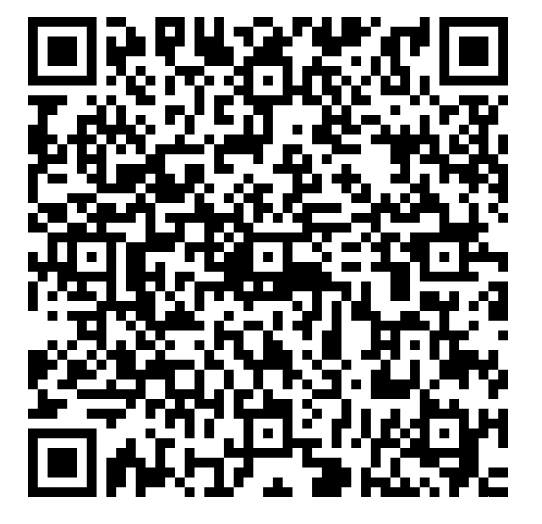

<div align="center">
  
</div>

# User Guide

## Table of Contents
1. [Overview](#overview)
2. [Installation and Setup](#installation-and-setup)
    - [Android](#android)
    - [iOS](#ios)
    - [Registration and Login](#registration-and-login)
3. [Designing A New Survey](#designing-a-new-survey)
    - [Organizing Items in a Survey](#organizing-items-in-a-survey)
    - [Adding Data Collection Tasks to the Survey](#adding-data-collection-tasks-to-the-survey)
    - [Creating Surveys with Spreadsheets](#creating-surveys-with-spreadsheets)
5. [Collecting Data](#collecting-data)
    - [Save Data Locally](#save-data)
    - [Upload Data](#upload-data)
    - [Saving a Survey](#saving-a-survey)
    - [Leaving a Survey Before You're Finished](#leaving-a-survey-before-youre-finished)
6. [Uploading Data](#uploading-data)
7. [Downloading Data](#downloading-data)
8. [Bug Reporting and Suggesting Improvements](#bug-reporting-and-suggesting-improvements)
9. [Contact](#contact)

## Overview

The data collection app is designed to facilitate the collection and organization of diverse data types using the capabilities of mobile devices. It operates **offline-first**, meaning you can collect and organize data without an active internet connection. Once online, the app synchronizes your data to a central cloud database, ensuring it is stored securely and accessible from anywhere.

The app supports various organizational layouts for observing and recording items, making it versatile for different data collection needs.


## Installation and Setup
### Android
Scan the QR Code below and follow the provided instructions. On Android 8.0 and higher, you may need to navigate to the 'Install unkown apps' system settings screen to enable app installations from a particular location (i.e. your web browser)

#### Download Android
<div style="margin: 20px 0;">
  
</div>

### iOS
Apple requires that iOS devices are registered using their IMEI code before installing software from outside the app store. To register your device:

1. Scan the QR code below and follow the provided instructions.
2. Contact the app developer and let them know you have registered a new device.
3. If you have not done so already, enable developer mode on your device. [Learn how to enable developer mode](https://docs.expo.dev/guides/ios-developer-mode/).

#### Register iOS
<div style="margin: 20px 0;">
  
</div>

#### Download iOS
Once the above steps are complete and the app developer has included your device's IMEI number, you can download and install the app by scanning this QR Code:

<div style="margin: 20px 0;">
  
</div>

### Registration and Login
Email and password based login is required to use the app. When first using the app, click the 'register' button to register a new account. You should automatically be logged in upon successful registration. 

Some features like password resetting and account recovery are not implemented yet. Contact app developer for account support.

## Designing A New Survey

The app supports creating and editing surveys using the **in-app GUI** as well as using **excel spreasheets in .xlsx format**. Spreadsheets can be uploaded to the app and will be processed into surveys. See [Creating Surveys with Spreadsheets](#creating-surveys-with-spreadsheets) for more details.

Select 'Manage Surveys' from the home screen followed by 'New Survey' and enter a unique name for the survey. Afterwards, the app will navigate to the **Survey Builder** view.

The Survey Builder is used to organize the structure your survey and specify the data collection tasks involved. **Make sure to save your survey design when finished by clicking 'Save'!**

Once the survey is saved, it will be synced to the cloud and other users will be able to use and interact with it.

<div style="margin: 20px 0;">
  
</div>

### Organizing Items in a Survey

Surveys are structured using Items, Collections, and Subcollections. 

**Items** are the real-world objects, events, or subjects you want to gather information on. Each item in your survey represents a specific thing you are interested in recording data about.

**Collections** are groupings of items, allowing you to organize related data points. Collections can also contain **Subcollections**, nested up to one level deep. This structure lets your surveys reflect various real-world layouts such as grids, heirarchies, and clusters.

#### Add a new collection
Click 'Collections' from the Survey Builder view and select 'Add Collection'. Give the new collection a unique name and press 'Done'.

<div style="margin: 20px 0;">
  
</div>

Inside an empty collection you have the option to start adding Items or to create a Subcollection.

<div style="margin: 20px 0;">
  
</div>

#### Add Items to a Collection

Select 'Add Item' and give the new item a unique name. for some use cases it can be useful to include a sequence of some sort in the name for organization (ie. Item 1, Item 2, Item 3).
Click 'Done' and your new Item should be visible in the collection.

<div style="margin: 20px 0;">
  
</div>


#### Delete Items or Collections

To delete items or collections, enter 'edit mode' by pressing and holding the desired Collection or Item button. Once in edit mode, press the corresponding delete buttons on the items you wish to remove. To exit 'edit mode,' simply press and hold again.

<div style="margin: 20px 0;">
  
</div>

### Adding Data Collection Tasks to the Survey
A **Task** is an action performed to collect data on Items. Each Item can have multiple tasks. For example, a survey might require a user to take a photo of an item (task 1) and then write down a label for that image (task 2).

From the Survey Builder view, select 'New Task' to see a list of the available task types

<div style="margin: 20px 0;">
  
</div>

#### Required Task Fields

Every task requires the following three basic fields: Display Name, Data Label, and Instructions. Additional fields may be needed for specific task types, which are detailed in their respective documentation.

**Display Name:** The visible name of the task. Aim for concise, descriptive names. This will be shown to the user performing the survey.
**Data Label:** The field name used in the JSON key/value pair when the data is collected. This key can be used when downloading and working with your data.
**Instructions:** Directions for the user completing the task.

<div style="margin: 20px 0;">
  
</div>

#### Deleting Tasks

To delete Tasks, enter 'edit mode' by pressing and holding a Task button. Once in edit mode, press the corresponding delete buttons on the Task you wish to remove. To exit 'edit mode,' simply press and hold again.

<div style="margin: 20px 0;">
  
</div>

#### Deleting Survey Designs
To delete an entire Survey Design, select 'Manage Surveys' from the Home screen. nter 'edit mode' by pressing and holding a Survey button. Once in edit mode, press the corresponding delete buttons on the Survey you wish to remove. To exit 'edit mode,' simply press and hold again.


### Creating Surveys with Spreadsheets
Survey designs can be created using .xlsx spreadsheets, allowing you to utilize the powerful features of spreadsheet editors. Tools like auto-fill and formulas can simplify the design of large, complex surveys, making them easier to manage and less time-consuming. You can find and copy a sample survey spreadsheet in the correct format here: [Sample Survey Spreadsheet](https://docs.google.com/spreadsheets/d/1US6NnQ0d1DGMfthzxKN5v8mVlgnrY3Fn/edit?usp=sharing&ouid=104744292422451722330&rtpof=true&sd=true)

#### Spreadsheet Tasks
The first sheet in the spreadsheet workbook defines your survey tasks. Use the leftmost column to select the task type from a dropdown menu. The Task Type ID will autofill. Fill in the three required fields for each task—Display Name, Data Label, and Instructions—in the subsequent columns.

<div style="margin: 20px 0;">
  
</div>

#### Spreadsheet Collections and Items
To define a new collection in your survey design, create a new sheet in your spreadsheet workbook. The name of this sheet will be used as the collection name. We recommend copying an existing collection sheet from the Sample_Survey.xlsx to maintain formatting.

To create a new item in this collection, fill in a row under the 'Item Name' column.

<div style="margin: 20px 0;">
  
</div>

#### Spreadsheet Subcollections and Other Optional Fields
To define a new subcollection in your survey design, enter the desired subcollection name in a row under the 'Subcollection' column and leave the rest of the row empty. The spreadsheet formatting will automatically highlight this row. All items listed below this row will be added to the subcollection.

**ItemID** is an optional field. Use it if the objects being studied have unique identifiers that you want to include in the survey data.

<div style="margin: 20px 0;">
  
</div>

#### Uploading a Spreadsheet

To upload a spreadsheet, go to 'Manage Surveys' from the Home Screen and select 'New Survey'. At the bottom of the screen, click 'Import From XLSX File' and use the file picker dialog to choose your XLSX file.

<div style="margin: 20px 0;">
  
</div>


## Collecting Data

**Begin a Survey**: From the Home Page, tap the 'Start Survey' button.
**View Collections:** You will see survey collections and subcollections for the selected survey.
**Collect Data:** Tap an item to start collecting data. You’ll be prompted to fill out details for each task in the survey.
Saving Your Data

Navigating back to the collection view should allow you to see which Survey Items have ben completed.

<div style="margin: 20px 0;">
  
</div>

Your data is automatically saved to the device as you enter it.
If you close the app or leave the survey, your data is cached and can be reloaded later.

### Save Data

**View Survey Summary**: Click the 'Save' icon in the upper-right corner to see an overview of your survey progress.
**Finish Survey**: Press 'Save Survey' to complete the current survey and mark it for upload.

<div style="margin: 20px 0;">
  
</div>

#### Upload Data
Select 'Upload Survey' from the Home Screen to view surveys ready for upload. Click on any Survey Results present to initiate a data upload. Data upload is disabled while offline. 

<div style="margin: 20px 0;">
  
</div>

#### Deleting Survey Data
To delete collected Survey Data, press and hold a Survey Data button. Once in edit mode, press the corresponding delete buttons on the Survey Data you wish to remove. To exit 'edit mode,' simply press and hold again.

## Downloading Data

Data download notebook example:

[Data download notebook example](https://colab.research.google.com/drive/1nqj_B1Fb1Wj9i3odYwqdXSxjvPSlokX7#scrollTo=neyS3pR0fhc8)

```python
import requests
import json

CLIENT_APP_ID = "data-pwljoor"
DATABASE_NAME = "SurveyResults"
COLLECTION_NAME = "SurveyResults"
API_KEY = <YOUR_KEY_HERE>

payload_dict = {
  "database": DATABASE_NAME,
  "collection": COLLECTION_NAME,
  "dataSource": "AtlasCluster",
  "filter": {
    "name": "Sample Survey"      # Insert the chosen filter
  } ,  
  "limit": 10
}

# serialize
payload = json.dumps(payload_dict)

headers = {
  'Access-Control-Request-Headers': '*',
  'apiKey': API_KEY,
  "Content-Type": "application/json",
  "Accept": "application/json"
}

try:
    response = requests.post(url, headers=headers, data=payload)

    if response.status_code != 200:
      raise Exception(f"Error: {response.text}")

    data = response.json()
    
except Exception as e:
    print(e)

```

## Bug Reporting and Suggesting Improvements
If you encounter a bug or have a suggestion for an improvement, please share it! You can...

1. [Create a new issue in the Github repository](https://github.com/SLUVisLab/field-collection-mobile/issues). (Recommended)
2. Contact the app developer directly

<div align="center" style="margin: 20px 0;">
  
</div>

## Contact

Contact Austin Carnahan on NRR-BII Slack or at austin.carnahan@slu.edu with questions or suggestions!
