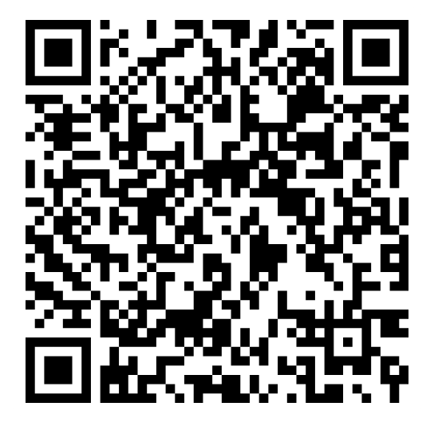

<div align="center">
  
</div>

# User Guide
(coming soon...)

## Table of Contents
1. [Overview](#overview)
2. [Installation and Setup](#installation-and-setup)
    - [Android](#android)
    - [iOS](#ios)
    - [Registration and Login](#registration-and-login)
3. [Managing Surveys](#managing-surveys)
    - [Collections, Subcollections, and Items](#collections-subcollections-and-items)
    - [Tasks](#tasks)
    - [Creating Surveys with Spreadsheets](#creating-surveys-with-spreadsheets)
4. [Collecting Data](#collecting-data)
    - [The Collections and Items List](#the-collections-and-items-list)
    - [The Survey Summary](#the-survey-summary)
    - [Saving a Survey](#saving-a-survey)
    - [Leaving a Survey Before You're Finished](#leaving-a-survey-before-youre-finished)
5. [Uploading Data](#uploading-data)
6. [Downloading Data](#downloading-data)
7. [Bug Reporting and Suggesting Improvements](#bug-reporting-and-suggesting-improvements)
8. [Contact](#contact)

## Overview
**NOTE:** The app is currently in its first beta release and full of bugs and opportunities for improvements. Please see the section on reporting bugs or suggesting improvements for more information on contributing.

The data collection app is designed to help collect and organize various types of data by leveraging the capabilities of mobile devices. The app is intended to work **offline-first**, with various organizational layouts of items being observed and recorded, and to **store data in a central cloud database**.

### Key Terms

- **Item:** The individual unit of study. This can represent a singular object or a grouping of objects depending on use-case.
- **Collection/Subcollection:** Items can be grouped into collections. Collections can also contain nested collections up to 1 level deep which are referred to as subcollections. Valid setups would include `collection/[item, item, item]` or `collection/subcollection1/[item, item, item]`.
- **Task:** A data collection action to be performed on items. One item can be associated with several tasks. For example, taking a photo and then recording text input (two tasks) could all be associated with one item.
- **Survey:** The overall set of items and tasks that define data collection and recording activities. Collections can be used to organize items into useful groups. The set of tasks defined in the survey will be performed once for each item defined in the survey.
- **Observation:** The recorded results of data collection activities in a survey. Each item in a survey will have one observation. Each observation will include the recorded data from the set of defined tasks.

## Installation and Setup
### Android
Scan the QR Code below and follow the provided instructions. On Android 8.0 and higher, you may need to navigate to the 'Install unkown apps' system settings screen to enable app installations from a particular location (i.e. your web browser)

#### Download Android
<div style="margin: 20px 0;">
  
</div>

### iOS
Apple requires that iOS devices are registered using their IMEI code before installing software from outside the app store. To register your device:

1. Scan the QR code below and follow the provided instructions.
2. Contact the app developer and let them know you have registered a new device.
3. If you have not done so already, enable developer mode on your device. [Learn how to enable developer mode](https://docs.expo.dev/guides/ios-developer-mode/).

#### Register iOS
<div style="margin: 20px 0;">
  
</div>

#### Download iOS
Once the above steps are complete and the app developer has included your device's IMEI number, you can download and install the app by scanning this QR Code:

<div style="margin: 20px 0;">
  
</div>

### Registration and Login
Email and password based login is required to use the app. When first using the app, click the 'register' button to register a new account. You should automatically be logged in upon successful registration. 

Some features like password resetting and account recovery are not implemented yet. Contact app developer for account support.

## Managing Surveys

The app supports creating and editing surveys using the **in-app GUI** as well as using **excel spreasheets in .xlsx format**. Spreadsheets can be uploaded to the app and will be processed into surveys. See [Creating Surveys with Spreadsheets](#creating-surveys-with-spreadsheets) for more details.

Select 'Manage Surveys' from the home screen to edit an existing survey or create a new one. when creating a new survey, you'll be prompted to enter a name for your survey.

### Collections, Subcollections, and Items


### Tasks


### Creating Surveys with Spreadsheets


[Sample Survey Spreadsheet](https://docs.google.com/spreadsheets/d/1US6NnQ0d1DGMfthzxKN5v8mVlgnrY3Fn/edit?usp=sharing&ouid=104744292422451722330&rtpof=true&sd=true)


## Collecting Data
### The Collections and Items List


### The Survey Summary


### Saving a Survey


### Leaving a Survey Before You're Finished


## Uploading Data


## Downloading Data


Data download notebook example:

[Data download notebook example](https://colab.research.google.com/drive/1nqj_B1Fb1Wj9i3odYwqdXSxjvPSlokX7#scrollTo=neyS3pR0fhc8)

```python
import requests
import json

CLIENT_APP_ID = "data-pwljoor"
DATABASE_NAME = "SurveyResults"
COLLECTION_NAME = "SurveyResults"
API_KEY = <YOUR_KEY_HERE>

filter_by_survey_name =  {
  "name": "Sample Survey"
}

payload_dict = {
  "database": DATABASE_NAME,
  "collection": COLLECTION_NAME,
  "dataSource": "AtlasCluster",
  "filter": filter_by_survey_name,  # Insert the chosen filter or example from above
  "limit": 10
}

# serialize
payload = json.dumps(payload_dict)

headers = {
  'Access-Control-Request-Headers': '*',
  'apiKey': API_KEY,
  "Content-Type": "application/json",
  "Accept": "application/json"
}

try:
    response = requests.post(url, headers=headers, data=payload)

    if response.status_code != 200:
      raise Exception(f"Error: {response.text}")

    data = response.json()
    
except Exception as e:
    print(e)


```

## Bug Reporting and Suggesting Improvements
If you encounter a bug or have a suggestion for an improvement, please share it! You can...

1. [Create a new issue in the Github repository](https://github.com/SLUVisLab/field-collection-mobile/issues). (Recommended)
2. Contact the app developer directly

<div align="center" style="margin: 20px 0;">
  
</div>

## Contact

Contact Austin Carnahan on NRR-BII Slack or at austin.carnahan@slu.edu with questions or suggestions!
